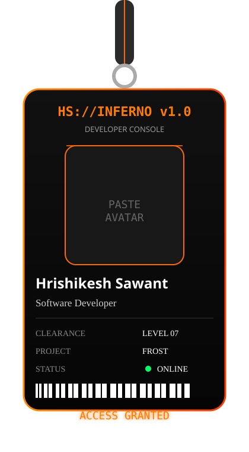
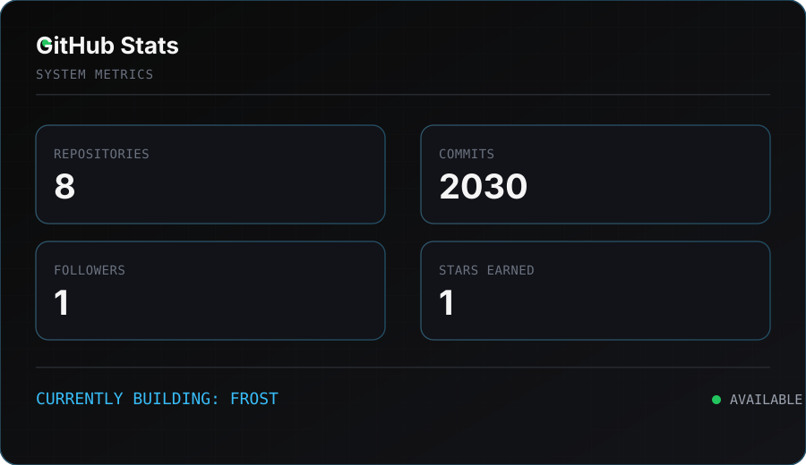
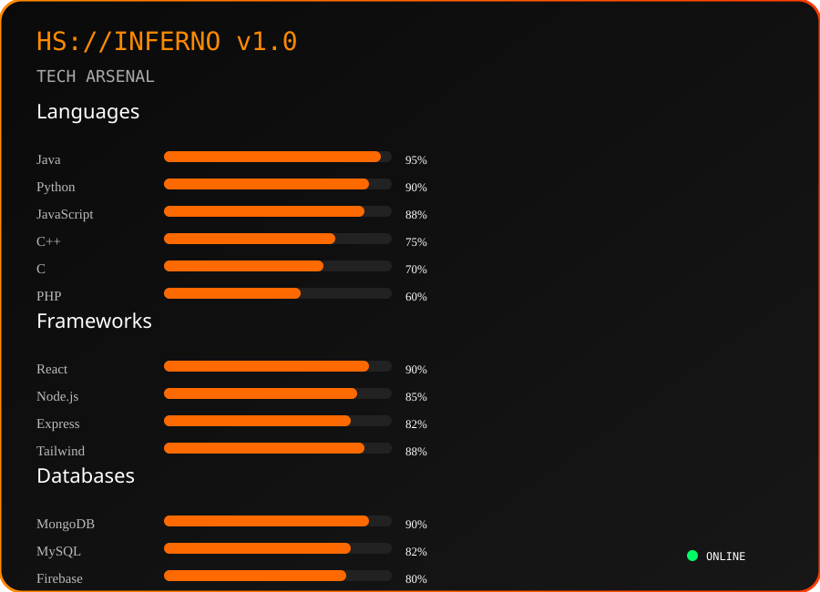
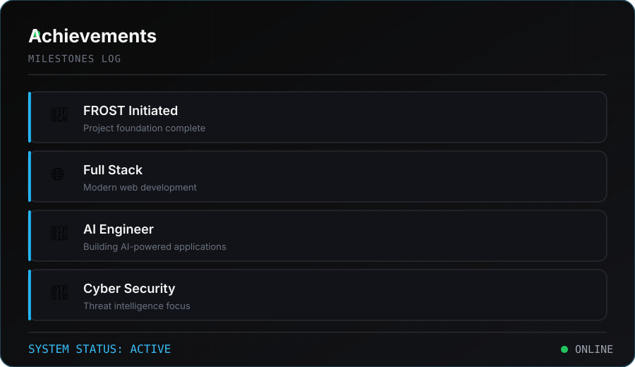

<!-- ✨ Animated Banner ✨ -->
<picture>
  <source media="(prefers-color-scheme: dark)" srcset="./assets/banner.svg">
  <source media="(prefers-color-scheme: light)" srcset="./assets/banner-light.svg">
  
</picture>

 

<table align="center" border="0">
<tr>
<td width="38%" align="center" valign="middle">

<!-- 🪪 Swinging Lanyard ID Card (pure SVG) -->

</td>
<td width="62%" valign="middle">

### 🚀 Featured Projects

| 💻 Project | ⚙️ Tech | 🔖 Status |
|:---|:---:|:---:|
| [🧊 FROST](https://github.com/HrishiSwant/FROST.git) | `AI` `Cyber Intel` | 🔄 Ongoing |
| [🎧 Spotify Clone](https://github.com/HrishiSwant) | `Next.js` `Spotify API` | 🔄 Ongoing |
| [🎬 Animation Showcase](https://github.com/HrishiSwant) | `React` | 🔄 Ongoing |
| [🧾 Invoice Generator](https://github.com/HrishiSwant) | `React` `Node.js` | 🔄 Ongoing |

 

> 🔐 *"Building secure, scalable & intelligent software."*

</td>
</tr>
</table>

 

### 📊 GitHub Stats & Graphs

  

  

<!-- 📈 Contribution Activity Graph -->

  

<!-- 🏆 Trophies (local animated SVG) -->

  

### 🐍 Watch the snake eat my contributions

  

### 📫 Let's Connect

  

  

*⭐ Always learning, always building.*

